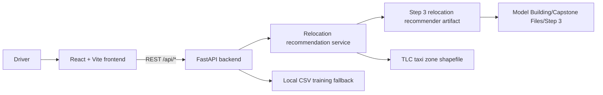
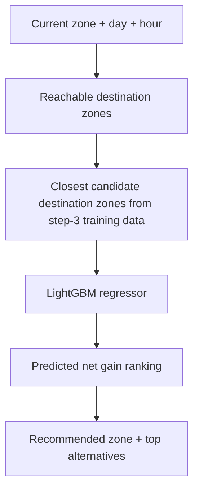

# Driver Earnings Navigator

Driver Earnings Navigator is a full-stack rideshare decision-support project for drivers. It is now focused entirely on relocation planning:

- a relocation recommender that suggests the best taxi zone to move toward next.

The repository is now organized into dedicated `frontend`, `backend`, and `data-engineering` areas so the application is easier to understand, run, and deploy.

## System architecture



## Repository structure

```text
Rideshare-Decision-ML/
  backend/
    app/
      api/
        endpoints/
        dependencies.py
        router.py
      core/
      data/
      ml/
      schemas/
      services/
      main.py
    Dockerfile
    README.md
    requirements.txt
  frontend/
    src/
      components/
      features/
      lib/
      App.jsx
      main.jsx
      styles.css
    Dockerfile
    nginx.conf
    README.md
    package.json
  data-engineering/
    architecture/
      rds-architecture.md
    sql/
      postgres-schema.sql
    README.md
  data/
    trips/
      Uber Rides - Cleaned.csv
  Model Building/
    Capstone Files/
      Step 3/
        relocation_model_with_recommender.pkl
        taxi_zone_lookup.csv
        uber_trips_training.parquet
        uber_trips_test.parquet
    content/
      taxi_zones/
  docker-compose.yml
```

## Machine learning models

### 1. Relocation recommender

The production relocation recommender now uses only `Model Building/Capstone Files/Step 3/relocation_model_with_recommender.pkl`, with runtime candidate generation driven by the accompanying `uber_trips_training.parquet` and `taxi_zone_lookup.csv`.



Notebook-backed details:

| Component | Model | Role | Source |
| --- | --- | --- | --- |
| Step 3 relocation recommender | `RelocationRecommender` + `LGBMRegressor` | Predicts `net_gain` for nearby candidate destination zones and packages lookup metadata used by the backend | `Model Building/Capstone Files/Step 3/Capstone Data Pipeline Step 3 with EDA.ipynb` |

Important notebook findings:

- The relocation notebook is built around NYC TLC HVFHV data plus TLC taxi-zone lookup and shapefiles.
- The exported step-3 recommender artifact wraps the trained LightGBM relocation model together with feature metadata and taxi-zone lookup data.
- The underlying model is trained on `PULocationID`, `DOLocationID`, `hour_bucket`, `day_of_week_numeric`, and `average_PU_to_DO_time`.
- The notebook evaluates candidate zones by predicted `net_gain`, then compares the recommendation against a stay-put baseline.
- The backend now mirrors that single-model workflow and no longer uses the older multi-model relocation pipeline.

### 2. Fallback training path

If the saved artifacts are missing, the backend can still start by training simplified models from:

- `data/trips/Uber Rides - Cleaned.csv`
- synthetic fallback data in `backend/app/data/sample_data.py`

That fallback path is implemented in:

- `backend/app/ml/training.py`
- `backend/app/data/trip_dataset.py`

## Data sources

- `Model Building/Capstone Files/Step 3/relocation_model_with_recommender.pkl`
  Saved relocation recommender artifact loaded by the backend.
- `Model Building/Capstone Files/Step 3/taxi_zone_lookup.csv`
  Taxi-zone lookup table used by the relocation artifact and zone selector.
- `Model Building/Capstone Files/Step 3/uber_trips_training.parquet`
  Step-3 training table used for relocation candidate generation at runtime.
- `Model Building/Capstone Files/Step 3/uber_trips_test.parquet`
  Step-3 evaluation table kept with the model-building assets.
- `Model Building/content/taxi_zones/*`
  Shapefile assets used by the backend to produce GeoJSON for the relocation map.
- `data/trips/Uber Rides - Cleaned.csv`
  Cleaned trip data used by the lightweight fallback pipeline.

## API surface

- `GET /api/health`
- `GET /api/zones`
- `GET /api/relocation-zones`
- `GET /api/relocation-zones-geojson`
- `POST /api/copilot/chat`
- `POST /api/recommend-zone`

## Local development

### Backend

```bash
cd backend
python -m venv .venv
.venv\Scripts\activate
pip install -r requirements.txt
uvicorn app.main:app --reload
```

The backend runs on `http://127.0.0.1:8000`.

### Frontend

```bash
cd frontend
npm install
copy .env.example .env
npm run dev
```

The frontend runs on `http://127.0.0.1:5173`.

## Docker deployment

This repo now includes Dockerfiles for both applications and a root `docker-compose.yml`.

```bash
docker compose up --build
```

Default ports:

- frontend: `http://localhost:5173`
- backend: `http://localhost:8000`

## Data engineering and RDS documentation

The new `data-engineering/` folder documents how to move the current local-file workflow into a PostgreSQL RDS-backed architecture:

- [data-engineering/README.md](data-engineering/README.md)
- [data-engineering/architecture/rds-architecture.md](data-engineering/architecture/rds-architecture.md)
- [data-engineering/sql/postgres-schema.sql](data-engineering/sql/postgres-schema.sql)
