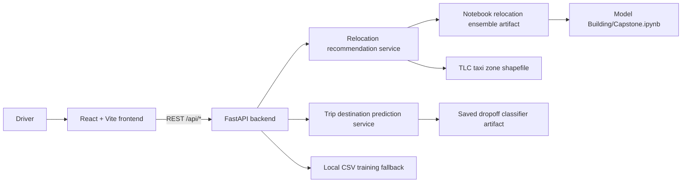
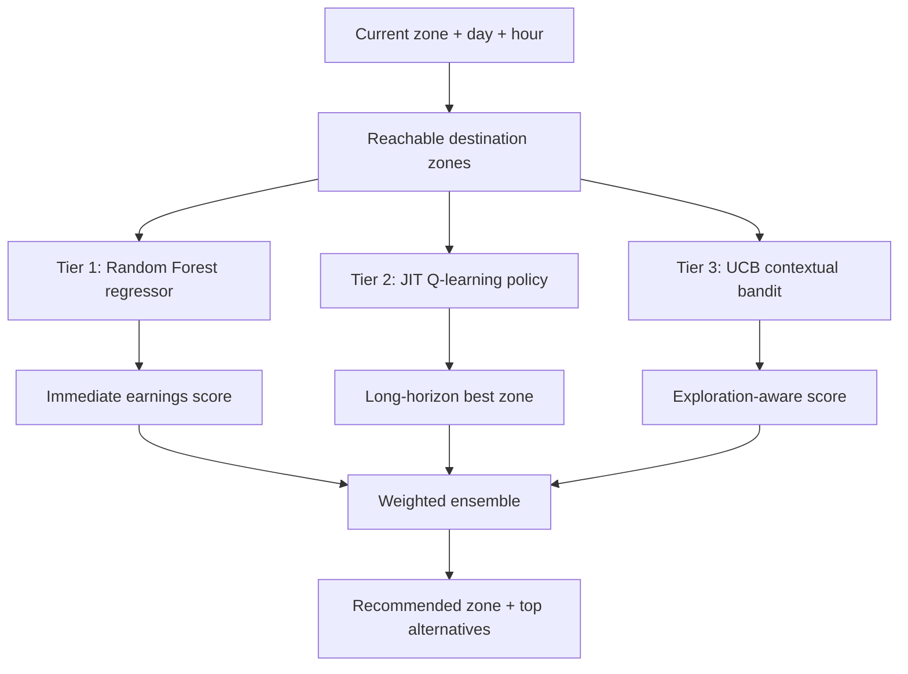
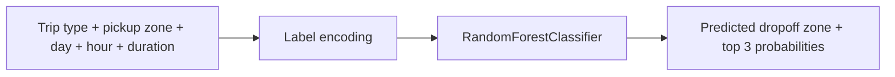

# Driver Earnings Navigator

Driver Earnings Navigator is a full-stack rideshare decision-support project for drivers. It gives drivers two practical tools:

- a relocation recommender that suggests the best taxi zone to move toward next,
- a trip evaluator that predicts the most likely dropoff zone for an offered ride.

The repository is now organized into dedicated `frontend`, `backend`, and `data-engineering` areas so the application is easier to understand, run, and deploy.

## System architecture



## Repository structure

```text
Rideshare-Decision-ML/
  backend/
    app/
      api/
        endpoints/
        dependencies.py
        router.py
      core/
      data/
      ml/
      schemas/
      services/
      main.py
    uber_dropoff_rf_model.joblib
    uber_label_encoders.joblib
    uber_relocation_ensemble_model_finalv1.joblib
    Dockerfile
    README.md
    requirements.txt
  frontend/
    src/
      components/
      features/
      lib/
      App.jsx
      main.jsx
      styles.css
    Dockerfile
    nginx.conf
    README.md
    package.json
  data-engineering/
    architecture/
      rds-architecture.md
    sql/
      postgres-schema.sql
    README.md
  data/
    trips/
      Uber Rides - Cleaned.csv
  Model Building/
    Capstone.ipynb
    content/
      taxi_zone_lookup.csv
      taxi_zones/
  docker-compose.yml
```

## Machine learning models

### 1. Relocation recommender

The production relocation recommender is documented in [Model Building/Capstone.ipynb](Model%20Building/Capstone.ipynb) and loaded by the backend from `backend/uber_relocation_ensemble_model_finalv1.joblib`.



Notebook-backed details:

| Layer | Model | Role | Source |
| --- | --- | --- | --- |
| Tier 1 | Random Forest Regressor | Predicts expected `pay_per_minute` for a destination zone at a given hour/day | `Capstone.ipynb` |
| Tier 2 | Q-learning | Finds a zone with stronger long-term reward instead of only short-term pay | `Capstone.ipynb` + deployed runtime logic |
| Tier 3 | UCB contextual bandit | Avoids sending every driver to the same hotspot and keeps exploration alive | `Capstone.ipynb` |

Important notebook findings:

- The relocation notebook is built around NYC TLC HVFHV data plus TLC taxi-zone lookup and shapefiles.
- The notebook reports a Random Forest relocation model with best settings of `n_estimators=50`, `max_depth=10`, and `min_samples_split=10`.
- The notebook reports relocation regression performance of `MAE = $0.12 per minute` and `RMSE = $0.19 per minute`.
- The notebook tunes the contextual bandit exploration constant and reports `c = 2.0` as the best UCB setting.
- The deployed backend currently combines the three relocation tiers with weights `0.60`, `0.25`, and `0.15` in `backend/app/services/recommender.py`.

### 2. Trip dropoff predictor

The dropoff model is served from `backend/uber_dropoff_rf_model.joblib` with label encoders in `backend/uber_label_encoders.joblib`.



Artifact-backed details:

- Model type: `RandomForestClassifier`
- Parameters loaded from the saved artifact: `n_estimators=200`, `min_samples_split=10`, `random_state=42`, `max_depth=None`
- Feature columns: `Trip_Type_Encoded`, `Day_of_Week_Num`, `Hour_Bucket`, `Duration_Minutes`, `Pickup_Zone_Encoded`
- Encoder coverage in the deployed artifact: 9 trip types, 35 pickup zones, and 43 dropoff zones

Note:
The main notebook in this repo focuses on the relocation ensemble. The dropoff model description above comes from direct inspection of the saved production artifact that the backend loads at runtime.

### 3. Fallback training path

If the saved artifacts are missing, the backend can still start by training simplified models from:

- `data/trips/Uber Rides - Cleaned.csv`
- synthetic fallback data in `backend/app/data/sample_data.py`

That fallback path is implemented in:

- `backend/app/ml/training.py`
- `backend/app/data/trip_dataset.py`

## Data sources

- `Model Building/content/uber_sampled_data_jan_feb_2026.csv`
  Sampled TLC HVFHV data used in the relocation notebook workflow.
- `Model Building/content/taxi_zone_lookup.csv`
  Taxi-zone lookup table for translating `LocationID` values into borough/zone names.
- `Model Building/content/taxi_zones/*`
  Shapefile assets used by the backend to produce GeoJSON for the relocation map.
- `data/trips/Uber Rides - Cleaned.csv`
  Cleaned trip data used by the lightweight fallback pipeline.

## API surface

- `GET /api/health`
- `GET /api/zones`
- `GET /api/relocation-zones`
- `GET /api/relocation-zones-geojson`
- `POST /api/recommend-zone`
- `GET /api/trip-pickup-zones`
- `GET /api/trip-types`
- `GET /api/resolve-trip-zone`
- `POST /api/evaluate-trip`

## Local development

### Backend

```bash
cd backend
python -m venv .venv
.venv\Scripts\activate
pip install -r requirements.txt
uvicorn app.main:app --reload
```

The backend runs on `http://127.0.0.1:8000`.

### Frontend

```bash
cd frontend
npm install
copy .env.example .env
npm run dev
```

The frontend runs on `http://127.0.0.1:5173`.

## Docker deployment

This repo now includes Dockerfiles for both applications and a root `docker-compose.yml`.

```bash
docker compose up --build
```

Default ports:

- frontend: `http://localhost:5173`
- backend: `http://localhost:8000`

## Data engineering and RDS documentation

The new `data-engineering/` folder documents how to move the current local-file workflow into a PostgreSQL RDS-backed architecture:

- [data-engineering/README.md](data-engineering/README.md)
- [data-engineering/architecture/rds-architecture.md](data-engineering/architecture/rds-architecture.md)
- [data-engineering/sql/postgres-schema.sql](data-engineering/sql/postgres-schema.sql)
