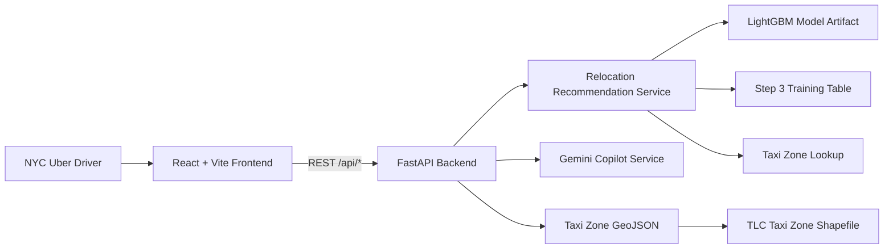

# Driver Earnings Navigator

**Deployed version:** <https://huggingface.co/spaces/BodrulJalal/Uber_Relocation_Planner>

Driver Earnings Navigator is a full-stack machine-learning app that helps NYC Uber drivers decide where to wait next. The app recommends nearby TLC taxi zones using historical Uber trip patterns, estimated travel time, and adjusted earning exposure.

## Quick Links

- [Deployed Hugging Face Space](https://huggingface.co/spaces/BodrulJalal/Uber_Relocation_Planner)
- [Capstone Documentation](docs/README.md)
- [Model Documentation](docs/model-documentation.md)
- [App Design](docs/app-design.md)
- [App Analysis](docs/app-analysis.md)
- [Data Dictionary](docs/data-dictionary.md)
- [RDS Architecture](data-engineering/architecture/rds-architecture.md)
- [PostgreSQL Schema](data-engineering/sql/postgres-schema.sql)

## Problem

NYC Uber drivers often decide where to wait between trips using experience, guesswork, or general knowledge of busy neighborhoods. During slower periods, this can lead to wasted time in weak-demand zones.

## Research Question

How can a machine-learning-powered web app help NYC Uber drivers reduce unproductive waiting time by recommending nearby NYC TLC zones to relocate to using historical Uber trip patterns, estimated travel time, and adjusted earning exposure?

The app addresses two related questions:

- Which nearby zone is historically stronger for waiting right now?
- Is relocating worth the travel time?

## Key Features

- Recommends the best nearby TLC taxi zone to wait in.
- Shows top alternative zones instead of only one answer.
- Explains recommendations using travel time and adjusted earning exposure.
- Highlights current, recommended, and alternative zones on a NYC taxi-zone map.
- Supports current device location or manual zone selection.
- Supports custom day/hour scenarios for planning or what-if analysis.
- Includes a Gemini-powered voice/text copilot for natural-language questions.

## Architecture

### App Architecture



### Data And Model Pipeline

```mermaid
flowchart LR
    Raw[Raw TLC HVFHV Monthly Data] --> Uber[Uber-Only Trip Extraction]
    Uber --> Zones[Taxi Zone Lookup Join]
    Zones --> Clean[Cleaned Trip Data]
    Clean --> Processed[Processed Trip Features]
    Processed --> Aggregates[Zone/Route Hourly Aggregates]
    Aggregates --> Training[Step 3 Relocation Training Table]
    Training --> LGBM[LightGBM Regressor]
    LGBM --> Artifact[Saved Relocation Model Artifact]
    Artifact --> Backend[FastAPI Recommendation Service]
    Backend --> App[React Driver App]
```



## Repository Structure

```text
Rideshare-Decision-ML/
  backend/
    app/
      api/
      core/
      data/
      ml/
      schemas/
      services/
      main.py
    Dockerfile
    README.md
    requirements.txt
  frontend/
    src/
      components/
      features/
      lib/
      App.jsx
      main.jsx
      styles.css
    Dockerfile
    nginx.conf
    README.md
    package.json
  data-engineering/
    architecture/
      rds-architecture.md
    sql/
      postgres-schema.sql
    README.md
  docs/
    app-analysis.md
    app-design.md
    data-dictionary.md
    model-documentation.md
    poster-plan.md
    research-question.md
  Model Building/
    Capstone Files/
      Step 1/
      Step 2/
      Step 3/
    content/
      taxi_zones/
  docker-compose.yml
```

## Machine Learning Model

The relocation recommender uses a LightGBM regression model trained from notebook-generated Step 3 relocation features.

Saved model artifact:

```text
Model Building/Capstone Files/Step 3/relocation_model_with_recommender.pkl
```

Direct model features:

- `PULocationID`
- `DOLocationID`
- `hour_bucket`
- `day_of_week_numeric`
- `average_PU_to_DO_time`

Target:

- `net_gain`

Final model metrics from the Step 3 notebook:

| Metric | Result |
|---|---:|
| MAE | 317.4087 |
| RMSE | 460.4430 |
| R-squared | 0.8854 |
| Average NDCG | 0.9749 |

More detail is documented in [docs/model-documentation.md](docs/model-documentation.md).

## Data Pipeline

The notebook workflow is organized into three stages:

1. **Step 1:** Load TLC HVFHV monthly data, filter to Uber records, join taxi-zone lookup data, and create cleaned trip files.
2. **Step 2:** Build route travel-time metrics, zone/hour earning metrics, trip density, opportunity scores, travel penalty, and `net_gain`.
3. **Step 3:** Train and evaluate the LightGBM relocation model and export the model artifact.

The current app loads local artifacts generated by this workflow. The production data-engineering plan describes how to move the same workflow into PostgreSQL/RDS tables and scheduled refresh jobs.

See:

- [docs/data-dictionary.md](docs/data-dictionary.md)
- [data-engineering/architecture/rds-architecture.md](data-engineering/architecture/rds-architecture.md)
- [data-engineering/sql/postgres-schema.sql](data-engineering/sql/postgres-schema.sql)

## API Surface

- `GET /api/health`
- `GET /api/zones`
- `GET /api/relocation-zones`
- `GET /api/relocation-zones-geojson`
- `POST /api/recommend-zone`
- `POST /api/copilot/chat`

## Local Development

### Backend

```bash
cd backend
python -m venv .venv
.venv\Scripts\activate
pip install -r requirements.txt
uvicorn app.main:app --reload
```

The backend runs on:

```text
http://127.0.0.1:8000
```

Backend environment variables:

```text
BACKEND_CORS_ORIGINS=http://localhost:5173,http://127.0.0.1:5173
GEMINI_API_KEY=your_key_here
GEMINI_MODEL=gemini-2.5-flash
```

### Frontend

```bash
cd frontend
npm install
copy .env.example .env
npm run dev
```

The frontend runs on:

```text
http://127.0.0.1:5173
```

Frontend environment variables:

```text
VITE_API_BASE_URL=http://127.0.0.1:8000
```


Default ports:

- frontend: `http://localhost:5173`
- backend: `http://localhost:8000`

## Evaluation Summary

Local app analysis is documented in [docs/app-analysis.md](docs/app-analysis.md).

Measured local performance:

| Metric | Result |
|---|---:|
| Frontend build time | 2.68 seconds |
| Backend startup time | 2.64 seconds |
| `/api/health` response time | 13.3 ms |
| `/api/relocation-zones` response time | 859.9 ms |
| `/api/relocation-zones-geojson` response time | 568.5 ms |
| `/api/recommend-zone` response time | 148.6 ms |

User feedback influenced the final app direction, including removing an offered-trip destination prediction feature, keeping explanation text, and adding the voice/text copilot.

## Capstone Documentation

The `docs/` folder contains the written evidence for the capstone rubric:

- [Research Question](docs/research-question.md)
- [App Design](docs/app-design.md)
- [App Analysis](docs/app-analysis.md)
- [Data Dictionary](docs/data-dictionary.md)
- [Model Documentation](docs/model-documentation.md)
- [Poster Plan](docs/poster-plan.md)

## Future Work

- Add streets and landmarks to the taxi-zone map.
- Refresh model features with new monthly data.
- Maintain rolling averages to capture seasonal, holiday, and event-driven trends.
- Add weather, events, airport delays, driver supply, and live demand signals.
- Run live driver testing to measure whether recommendations reduce wait time during slower periods.
