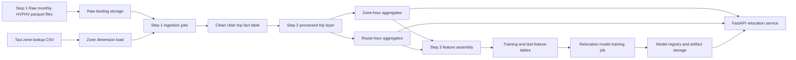
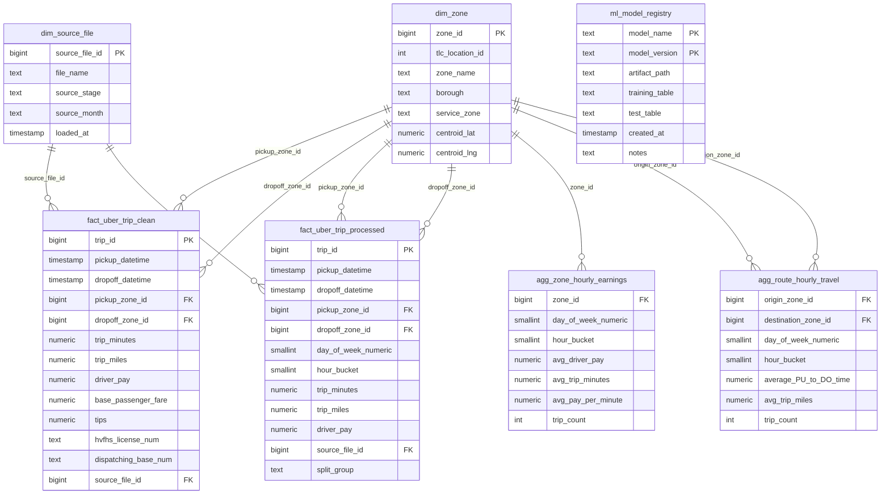

# RDS Architecture

## Purpose

This document describes how to take the current relocation-model notebook workflow and turn it into a scalable production data system.

The design is based directly on the notebook sequence in:

- `Model Building/Capstone Files/Step 1`
- `Model Building/Capstone Files/Step 2`
- `Model Building/Capstone Files/Step 3`

The goal is to preserve the same modeling logic you used manually, but move it into a database-backed pipeline that is easier to refresh, monitor, retrain, and deploy.

## What the notebooks are doing today

### Step 1: Raw TLC monthly ingestion and Uber trip extraction

The step-1 notebooks start from monthly TLC HVFHV parquet files such as:

- `fhvhv_tripdata_2026-01.parquet`
- `fhvhv_tripdata_2026-02.parquet`
- `fhvhv_tripdata_2026-03.parquet`

They then:

- combine monthly raw files,
- join taxi-zone lookup data,
- filter to the Uber-specific provider records used in the project,
- remove unwanted zones and low-quality records,
- create a cleaned trip-level dataset for the next stage.

This is the raw-to-clean transformation stage.

### Step 2: Processed trip dataset and aggregate creation

The step-2 notebooks work from the cleaned trip output and produce processed trip tables such as:

- `uber_trips.parquet`
- `uber_trips_march_test.parquet`

This stage is where the trip records become stable analytical inputs. It is the right place to calculate and persist:

- standardized pickup and dropoff timestamps,
- trip duration and distance fields,
- day-of-week and hour bucket fields,
- cleaned pickup/dropoff zone mappings,
- reusable trip tables for both training and testing.

This is also the stage where scalable aggregate jobs should compute:

- zone-by-hour earning opportunity metrics,
- zone-to-zone travel-time metrics,
- any relocation scoring inputs reused by training or inference.

### Step 3: Feature engineering and relocation model training

The step-3 notebook uses the processed trip data to produce the final relocation training and test sets:

- `uber_trips_training.parquet`
- `uber_trips_test.parquet`

It then trains and exports:

- `relocation_model_with_recommender.pkl`

This stage is responsible for:

- assembling relocation features,
- calculating the `net_gain` target,
- training the LightGBM-based relocation recommender,
- packaging model state plus lookup metadata for backend use.

This is the feature-and-model stage.

## Production version of the same workflow

The production system should follow the same three stages, but run them inside a repeatable data pipeline backed by PostgreSQL RDS.

## Recommended data layers

### 1. Landing layer

This layer stores files exactly as received.

Examples:

- raw monthly HVFHV parquet files,
- raw taxi-zone lookup CSV,
- raw shapefile assets if needed for mapping.

Purpose:

- preserve source data,
- support replay if a pipeline step fails,
- keep an auditable copy of every monthly input.

### 2. Step 1 ingestion layer

This layer should represent the output of your step-1 notebooks.

Recommended table:

- `stg_hvfhv_trip_raw`
  Raw monthly trip rows loaded from parquet.

Recommended cleaned table:

- `fact_uber_trip_clean`
  Uber-only trip records after filtering, zone enrichment, and record cleanup.

This table should contain the fields your notebooks rely on most, including:

- pickup and dropoff datetimes,
- pickup and dropoff TLC location IDs,
- trip time and trip miles,
- driver pay and fare components,
- provider/base filters used to isolate the Uber slice,
- source month and source file metadata.

### 3. Step 2 processed analytics layer

This layer should mirror the output of your step-2 notebooks.

Recommended table:

- `fact_uber_trip_processed`

This is the canonical processed trip table used by downstream feature jobs.

It should add or standardize:

- `day_of_week_numeric`
- `hour_bucket`
- validated pickup/dropoff zones
- cleaned trip durations
- cleaned route-level fields
- train/test split tags if you want deterministic reproducibility

From this processed trip table, the pipeline should build reusable aggregate tables.

Recommended aggregate tables:

- `agg_zone_hourly_earnings`
  Zone, day, and hour level metrics describing earning opportunity and demand context.
- `agg_route_hourly_travel`
  Pickup zone, dropoff zone, day, and hour level travel-time metrics.

These tables are the scalable replacement for recalculating notebook aggregates every time.

### 4. Step 3 feature and training layer

This layer should mirror the step-3 notebook outputs.

Recommended tables:

- `ml_relocation_training_set`
- `ml_relocation_test_set`

These tables should contain the exact feature columns used by the model, including:

- `PULocationID`
- `DOLocationID`
- `hour_bucket`
- `day_of_week_numeric`
- `average_PU_to_DO_time`
- target fields such as `net_gain`

The training job then reads from these tables and writes:

- the trained relocation artifact,
- evaluation outputs,
- model metadata,
- feature version metadata.

## Recommended PostgreSQL entities

### Dimensions

- `dim_zone`
  TLC zone lookup data used across all stages.
- `dim_source_file`
  Tracks which monthly parquet file or notebook-era export each record came from.
- `dim_model_version`
  Tracks model versions, artifact paths, notebook lineage, and deployment notes.

### Facts

- `fact_uber_trip_clean`
  Output of the step-1 cleaning logic.
- `fact_uber_trip_processed`
  Output of the step-2 processing logic.

### Aggregates

- `agg_zone_hourly_earnings`
  Zone/day/hour earning opportunity metrics used by relocation scoring.
- `agg_route_hourly_travel`
  Zone-to-zone/day/hour travel metrics used by relocation scoring.

### ML tables

- `ml_relocation_training_set`
  Final training rows used in step 3.
- `ml_relocation_test_set`
  Final test rows used in step 3.
- `ml_model_registry`
  Saved artifact metadata for deployment and rollback.

## ER diagram

## How this maps to the current codebase

- [backend/app/ml/model_manager.py](/c:/Users/Bodru/OneDrive/Desktop/Github/Rideshare-Decision-ML/backend/app/ml/model_manager.py:1)
  Loads the exported step-3 relocation artifact plus the taxi-zone lookup and training parquet.
- [backend/app/services/recommender.py](/c:/Users/Bodru/OneDrive/Desktop/Github/Rideshare-Decision-ML/backend/app/services/recommender.py:1)
  Uses the equivalent of `dim_zone`, `agg_route_hourly_travel`, and step-3 training features to rank relocation options.
- `Model Building/Capstone Files/Step 1`
  Corresponds to the raw ingestion and Uber-only filtering stage.
- `Model Building/Capstone Files/Step 2`
  Corresponds to the processed trip and aggregate-building stage.
- `Model Building/Capstone Files/Step 3`
  Corresponds to final feature assembly, training/test generation, and exported relocation artifact creation.

## Recommended production deployment pattern

1. Land each new monthly HVFHV parquet file in object storage.
2. Run a step-1 ingestion job that loads raw files into staging tables and produces `fact_uber_trip_clean`.
3. Run a step-2 processing job that standardizes time, zone, and trip fields into `fact_uber_trip_processed`.
4. Refresh `agg_zone_hourly_earnings` and `agg_route_hourly_travel`.
5. Build `ml_relocation_training_set` and `ml_relocation_test_set` using the same logic as the step-3 notebook.
6. Train and export a new `relocation_model_with_recommender.pkl`.
7. Register the artifact in `ml_model_registry`.
8. Deploy the backend against the approved model version.

## Why this is a better production design

It keeps your exact notebook logic, but makes it production-friendly by:

- separating raw, cleaned, processed, aggregate, and training data,
- making monthly refreshes repeatable,
- avoiding manual notebook-only transformations,
- preserving feature lineage from parquet input to deployed model,
- supporting future retraining without reorganizing the backend.
