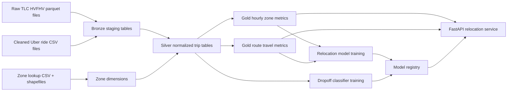
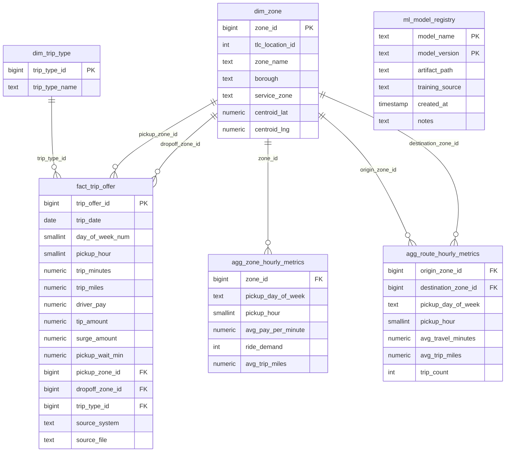

# RDS Architecture

## Goal

Move the project from file-based local training inputs to a database-backed layout that can support:

- repeatable ingestion from TLC/HVFHV and cleaned Uber ride exports,
- feature aggregation for relocation scoring,
- trip-level storage for destination prediction,
- model artifact tracking for backend deployments.

## Proposed data flow

## Recommended PostgreSQL entities

### Dimensions

- `dim_zone`
  TLC location metadata, boroughs, service zones, and optional centroid coordinates.
- `dim_trip_type`
  Canonical trip type values used by the trip model.

### Facts

- `fact_trip_offer`
  Trip-level records from cleaned Uber exports or normalized HVFHV records.
- `agg_zone_hourly_metrics`
  Zone-by-hour aggregates used to estimate demand and pay-per-minute.
- `agg_route_hourly_metrics`
  Origin/destination/hour aggregates used for relocation travel-time lookups.

### ML operations

- `ml_model_registry`
  Tracks artifact path, source dataset, version, and deployment notes.

## ER diagram

## How this maps to the current codebase

- `backend/app/services/recommender.py`
  Uses the equivalent of `agg_zone_hourly_metrics`, `agg_route_hourly_metrics`, and `dim_zone`.
- `backend/app/services/fare_predictor.py`
  Uses trip-type and pickup-zone dimensions plus trip-duration features sourced from `fact_trip_offer`.
- `Model Building/Capstone.ipynb`
  Produces the relocation ensemble artifact from hourly zone and route features.

## Recommended deployment pattern

1. Land raw parquet and cleaned CSV files in object storage or staging.
2. Normalize them into `fact_trip_offer` plus `dim_zone` and `dim_trip_type`.
3. Refresh hourly aggregates into the gold tables.
4. Retrain models offline and write artifact metadata into `ml_model_registry`.
5. Deploy the backend with the selected artifact versions.
