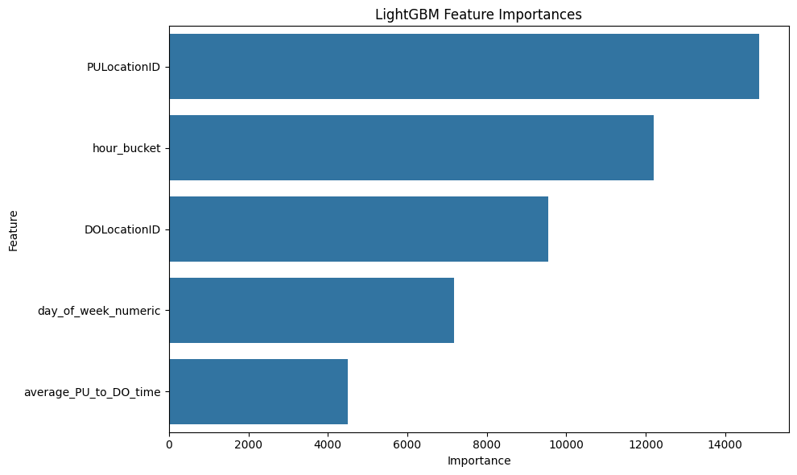
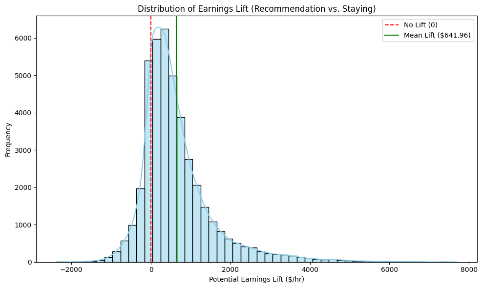
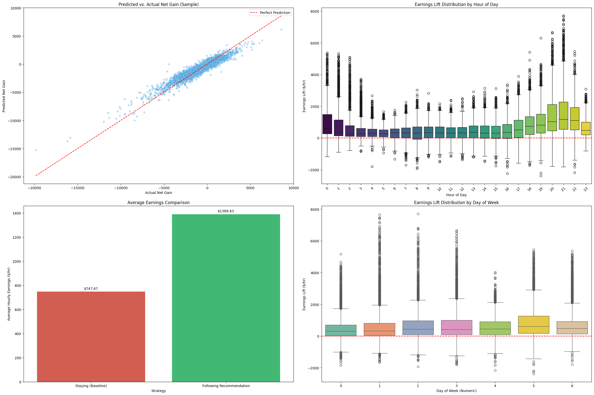

# Model Documentation

## Model Purpose

The relocation model predicts whether an NYC Uber driver should stay in the current TLC taxi zone or relocate toward a nearby candidate zone. It is designed for decision support during slower periods when waiting in the wrong zone can waste time.

The model does not predict a driver's guaranteed personal earnings. It predicts a relocation score based on historical market patterns, travel time between zones, day of week, and hour of day. The app then turns that score into a recommendation with explanation text, adjusted earning exposure, travel time, and top alternatives.

## Notebook Pipeline Summary

The model-building workflow is documented in the notebooks under `Model Building/Capstone Files`.

### Step 1: Uber Trip Extraction And Initial Features

Notebooks:

- `Step 1/Capstone Data Pipeline Step 1 Training.ipynb`
- `Step 1/Capstone Data Pipeline Step 1 March Test.ipynb`

Main actions:

- Loaded TLC HVFHV monthly parquet files.
- Filtered records to Uber trips using `hvfhs_license_num == 'HV0003'`.
- Joined TLC taxi-zone lookup data for pickup and dropoff zone names and boroughs.
- Converted datetime fields.
- Engineered early time features:
  - `time_from_request_to_pickup`
  - `day_of_week`
  - `hour_bucket`
- Exported cleaned Uber trip parquet files for the next stage.

Training data used January and February 2026. March 2026 was prepared as a separate test/evaluation month.

### Step 2: Aggregates And Relocation Target Construction

Notebooks:

- `Step 2/Capstone Data Pipeline Step 2 Training.ipynb`
- `Step 2/Capstone Data Pipeline Step 2 March Test.ipynb`

Main actions:

- Calculated average pickup-zone to dropoff-zone travel time by:
  - pickup zone
  - dropoff zone
  - hour
  - day of week
- Calculated zone/hour earning opportunity metrics using driver pay and tips.
- Calculated trip density by zone/hour.
- Built pickup-zone and destination-zone opportunity scores.
- Penalized relocation options by travel time.
- Created the relocation target:

```text
net_gain =
    DO_avg_market_total_earnings_per_hour
    - PU_avg_market_total_earnings_per_hour
    - travel_penalty
```

This target represents whether the destination zone historically offered enough additional earning exposure to justify the travel time from the current zone.

### Step 3: Model Training, Evaluation, And Recommendation Logic

Notebook:

- `Step 3/Capstone Data Pipeline Step 3 with EDA.ipynb`

The final Step 3 training table has:

- 3,185,960 rows
- 13 columns
- no missing values in the final model table

Final Step 3 columns:

| Column | Role |
|---|---|
| `PULocationID` | Current/origin zone. |
| `DOLocationID` | Candidate destination zone. |
| `hour_bucket` | Hour-of-day feature. |
| `day_of_week_numeric` | Day-of-week feature. |
| `average_PU_to_DO_time` | Average travel time between origin and destination zones. |
| `PU_avg_market_total_earnings_per_hour` | Historical earning opportunity in the current zone. |
| `DO_avg_market_total_earnings_per_hour` | Historical earning opportunity in the candidate zone. |
| `PU_trip_density_per_hour` | Historical pickup-zone trip density. |
| `DO_trip_density_per_hour` | Historical destination-zone trip density. |
| `PU_zone_opportunity_score` | Engineered pickup-zone opportunity score. |
| `DO_zone_opportunity_score` | Engineered destination-zone opportunity score. |
| `travel_penalty` | Opportunity cost of relocation time. |
| `net_gain` | Target variable for the model. |

## Model Type

The selected model is a LightGBM regressor.

LightGBM is a gradient boosting framework that builds an ensemble of decision trees. Each new tree tries to correct errors from earlier trees. This makes it useful for structured tabular data with nonlinear relationships, interactions, and large row counts.

## Why LightGBM Was A Good Fit

LightGBM was a strong choice for this project because:

- The data is tabular, not image, audio, or text data.
- The training table is large, with more than 3.1 million rows.
- The relationship between zone, hour, day, travel time, and relocation gain is likely nonlinear.
- Interactions matter. For example, the value of a destination zone can depend on both the hour and the current zone.
- LightGBM trains efficiently compared with many tree ensemble approaches on large tabular datasets.
- It provides feature importance values, which helps explain which inputs influenced the model.

## Why Not Simpler Or Heavier Alternatives

These alternatives were not selected for the final app:

| Alternative | Why It Was Less Suitable |
|---|---|
| Linear regression | Easier to interpret, but likely too simple for nonlinear zone/hour/day interactions and spatial relocation patterns. |
| Random forest | Can model nonlinear relationships, but often trains and predicts more slowly on very large datasets and may be less efficient for ranking many candidate zones. |
| Deep learning | More complex than necessary for this structured tabular problem and harder to justify with the current feature set. |
| Rule-based scoring only | Easier to explain, but less flexible than learning from historical pickup/dropoff/time combinations. |

The notebook did not complete a full benchmark against all of these alternatives. The final model choice was based on the fit between LightGBM and the project needs: large tabular data, nonlinear interactions, fast inference, ranking candidate zones, and readable feature importance.

## Objective, Loss, And Tuning

The model was trained as a regression model:

```python
objective = "regression"
```

### Why This Is A Regression Problem

The model predicts a numeric value: `net_gain`. This is why the model is trained as a regression model instead of a classification model.

A classification model would answer a category-style question, such as:

```text
Relocate or do not relocate?
```

The relocation app needs more than that. It needs to compare multiple possible zones and rank them. A numeric predicted gain is more useful because it lets the backend sort candidate zones from strongest to weakest.

In this project:

```text
higher predicted_net_gain = better relocation candidate
```

### Loss Function

LightGBM's standard `regression` objective optimizes a squared-error style loss. In plain English, the model is punished more when its prediction is far away from the true `net_gain`.

If the true `net_gain` is 500 and the model predicts 480, that is a small error. If the model predicts -200, that is a much larger error and receives a much larger penalty.

Squared-error loss is useful here because large prediction mistakes can lead to bad recommendations. A zone that looks very profitable when it is actually weak could send a driver in the wrong direction.

### Regression Metrics

The notebook evaluated prediction error with:

- MAE
- RMSE
- R-squared

These metrics answer slightly different questions.

| Metric | Meaning | How To Interpret It In This Project |
|---|---|---|
| MAE | Mean Absolute Error. The average size of the model's prediction error. | Lower is better. It shows the typical prediction miss in `net_gain` units. |
| RMSE | Root Mean Squared Error. Similar to MAE, but it penalizes large mistakes more heavily. | Lower is better. It is useful because very wrong relocation scores are more harmful than small errors. |
| R-squared | How much variation in the target the model explains. | Higher is better. A value near 0 means the model is not explaining much; a value closer to 1 means it explains much more of the observed pattern. |

The final tuned model produced:

| Metric | Final Value |
|---|---:|
| MAE | 317.4087 |
| RMSE | 460.4430 |
| R-squared | 0.8854 |

An R-squared of 0.8854 means the model explained a large share of the variation in historical `net_gain`. The error metrics are still important because the app should not treat the prediction as exact individual driver earnings.

### Why Ranking Quality Matters

The app is not mainly asking:

```text
Can the model predict the exact net_gain value perfectly?
```

The app is mostly asking:

```text
Can the model rank the candidate zones so the better relocation options appear near the top?
```

That is why the notebook also evaluated ranking quality with:

- NDCG

### What NDCG Means

NDCG stands for Normalized Discounted Cumulative Gain.

It is a ranking metric. It is commonly used when the order of recommendations matters, such as search results, product recommendations, or in this case relocation-zone recommendations.

For this app, each recommendation context is something like:

```text
Current zone = Cambria Heights
Hour = 2 PM
Day = Wednesday
Candidate zones = Saint Albans, Hollis, Bellerose, Queens Village, stay put, ...
```

The model gives each candidate zone a predicted score. The true historical data also has an actual `net_gain`. NDCG checks whether the model puts the truly better candidates near the top.

The key idea:

- A good ranking puts high-gain zones at the top.
- A bad ranking puts weak zones above strong zones.
- NDCG ranges from 0 to 1.
- 1 means the ranking is ideal.
- Higher is better.

The final model's average NDCG was:

```text
0.9749
```

That is very high, meaning the model was very strong at ordering candidate relocation zones in the historical test data.

### How NDCG Was Used In The Notebook

The notebook grouped candidate zones by the driver's context:

```python
['PULocationID', 'hour_bucket', 'day_of_week_numeric']
```

For each group, the notebook compared:

- the actual `net_gain` values from the test table,
- the model's predicted scores for those same candidates.

Then it calculated NDCG for groups that had at least two candidate zones. This matters because ranking only makes sense when there is more than one option to compare.

The notebook also shifted true values when needed because NDCG expects non-negative relevance scores. Since `net_gain` can be negative, the notebook adjusted those values within each group before calculating NDCG.

### How To Explain NDCG Out Loud

If asked what NDCG is, a simple answer is:

> NDCG measures whether the model puts the best relocation options near the top of the list. That matters because the app is a recommender. Even if the exact predicted gain is not perfect, the app is useful if it ranks the better zones above the weaker zones.

If asked why NDCG matters more than only RMSE:

> RMSE tells me how far off the numeric predictions are. NDCG tells me whether the ordering of recommendations is good. Since the user sees a ranked list of zones, ranking quality is directly tied to the app experience.

## Hyperparameter Tuning With Optuna

### What Hyperparameters Are

Hyperparameters are model settings chosen before or during training. They are not learned from the data in the same way tree splits are learned. They control how the model learns.

Examples in this project:

- how many trees to build,
- how fast each tree learns,
- how complex each tree can be,
- how much regularization to use,
- how much row/column sampling to use.

Bad hyperparameters can make a model too simple, too slow, or too overfit to the training data.

### What Optuna Is

Optuna is a hyperparameter optimization library. Instead of manually guessing one set of model settings, Optuna tries different combinations and keeps track of which settings perform best.

In this notebook:

1. A search space was defined for LightGBM settings.
2. Optuna ran multiple trials.
3. Each trial trained a LightGBM model with a different parameter combination.
4. Each trial predicted on the test data.
5. The notebook calculated RMSE.
6. Optuna selected the parameter set with the lowest RMSE.

The study direction was:

```python
direction = "minimize"
```

That means Optuna was trying to minimize prediction error.

The tuning objective was:

```python
return rmse
```

So the best trial was the one with the smallest RMSE.

Tuned search space:

| Hyperparameter | Search Range |
|---|---|
| `n_estimators` | 300 to 1200 |
| `learning_rate` | 0.01 to 0.1 |
| `num_leaves` | 20 to 100 |
| `max_depth` | 5 to 15 |
| `min_child_samples` | 20 to 100 |
| `subsample` | 0.7 to 1.0 |
| `colsample_bytree` | 0.7 to 1.0 |
| `reg_alpha` | 0.001 to 10.0 |
| `reg_lambda` | 0.001 to 10.0 |

Best tuned parameters from the notebook:

| Hyperparameter | Selected Value |
|---|---:|
| `n_estimators` | 700 |
| `learning_rate` | 0.038330018979333344 |
| `num_leaves` | 70 |
| `max_depth` | 11 |
| `min_child_samples` | 40 |
| `subsample` | 0.8 |
| `colsample_bytree` | 0.9 |
| `reg_alpha` | 0.05192539438465435 |
| `reg_lambda` | 0.005425711988482697 |

## Model Inputs

The saved LightGBM model directly uses five features:

| Feature | Meaning |
|---|---|
| `PULocationID` | Current TLC taxi zone. |
| `DOLocationID` | Candidate relocation zone. |
| `hour_bucket` | Hour of day. |
| `day_of_week_numeric` | Day of week as a numeric value. |
| `average_PU_to_DO_time` | Average travel time from current zone to candidate zone. |

The additional Step 3 columns are still important because they create the `net_gain` target, support explanation text, and help the backend display adjusted earning exposure and demand context.

## Model Output

The model predicts:

```text
predicted_net_gain
```

Higher predicted net gain means the destination zone is expected to be a better relocation candidate after accounting for the cost of travel time.

In the app, the backend:

1. Gets the current zone, day, and hour.
2. Finds historical candidate destination zones for that context.
3. Keeps the closest candidate zones by average travel time.
4. Adds a stay-put option where pickup and destination zone are the same.
5. Scores each candidate with the LightGBM model.
6. Sorts candidates by predicted net gain.
7. Returns the best recommendation plus top alternatives.

## Evaluation Results

### Regression Metrics

| Model | MAE | RMSE | R-squared | Average NDCG |
|---|---:|---:|---:|---:|
| Baseline LightGBM | 321.0431 | 467.5361 | 0.8818 | 0.9750 |
| Tuned LightGBM | 317.4087 | 460.4430 | 0.8854 | 0.9749 |

The tuned model slightly improved MAE, RMSE, and R-squared compared with the baseline. NDCG stayed very high, which is important because the app depends on ranking relocation candidates rather than only predicting an exact dollar value.

### Feature Importance

The final model's feature importance ranking:

| Rank | Feature | Importance |
|---:|---|---:|
| 1 | `PULocationID` | 14863 |
| 2 | `hour_bucket` | 12204 |
| 3 | `DOLocationID` | 9541 |
| 4 | `day_of_week_numeric` | 7182 |
| 5 | `average_PU_to_DO_time` | 4510 |



### Simulated Recommendation Impact

The notebook compared staying in the current zone against following the model recommendation across sampled contexts where a stay-put baseline existed.

Notebook result:

| Metric | Value |
|---|---:|
| Simulated contexts | 42,367 |
| Average baseline earning exposure from staying | $747.67/hr |
| Average potential earning exposure following recommendation | $1,389.63/hr |
| Average absolute lift per relocation | +$641.96/hr |
| Average percentage lift | +85.86% |

These values should be interpreted as historical market earning exposure, not guaranteed individual driver pay. The result is still useful because it shows the model often identifies zones with stronger historical opportunity after accounting for relocation time.



The notebook also produced a model evaluation dashboard with predicted-vs-actual net gain, earnings lift by hour, average baseline vs recommendation, and earnings lift by day.



## Exported Artifact

The notebook exported the trained model with Joblib. The production backend currently loads:

```text
Model Building/Capstone Files/Step 3/relocation_model_with_recommender.pkl
```

The backend also loads:

```text
Model Building/Capstone Files/Step 3/uber_trips_training.parquet
Model Building/Capstone Files/Step 3/taxi_zone_lookup.csv
```

These files let the backend reproduce the same recommendation workflow from the notebook inside the FastAPI app.

## Limitations

- The model is trained on historical patterns, so it cannot guarantee future individual driver earnings.
- It does not currently use real-time driver supply, live demand, weather, event schedules, road closures, or holidays.
- Browser/device location can be imperfect, so manual zone selection remains important.
- Some zone/time combinations may have limited or missing historical candidate data.
- The current evaluation focuses on historical market exposure and ranking quality, not live field earnings from controlled driver experiments.
- The hourly earning exposure values can be high because they represent aggregated market activity, not one driver's guaranteed hourly pay.

## Future Model Improvements

Future versions could improve the model by:

- refreshing with new monthly data on a scheduled cadence,
- maintaining rolling averages for zone/hour and route/hour aggregates,
- adding holiday, event, weather, traffic, airport, and school-calendar features,
- incorporating driver supply signals if available,
- testing additional model families such as random forest, XGBoost, CatBoost, or regularized linear models as formal benchmarks,
- evaluating live user outcomes, such as whether recommendations reduce wait time during slower periods.
