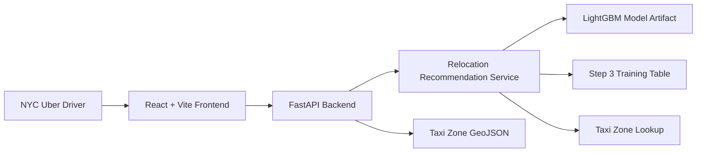
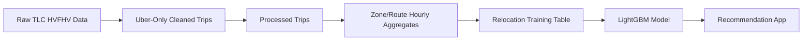

# Poster Plan

## Poster Title

Driver Earnings Navigator: Machine Learning Relocation Recommendations For NYC Uber Drivers

## One-Sentence Pitch

Driver Earnings Navigator helps NYC Uber drivers decide where to wait next by ranking nearby TLC taxi zones using historical Uber trip patterns, average travel time, and adjusted earning exposure.

## Poster Goal

The poster should quickly show:

- the real driver problem,
- the web app solution,
- the ML/data pipeline,
- the app interface,
- the evaluation evidence,
- and the next production improvements.

The poster should rely on screenshots, diagrams, and short callouts rather than long paragraphs.

## Recommended Poster Layout

Use a 3-column layout if the assignment format allows it.

### Column 1: Problem And Users

Purpose: Establish why the app matters.

Include:

- Research question.
- Target users.
- Pain points.
- One short user journey.

Suggested text:

```text
Research Question:
How can a machine-learning-powered web app help NYC Uber drivers reduce unproductive waiting time by recommending nearby TLC taxi zones using historical Uber trip patterns, estimated travel time, and adjusted earning exposure?
```

Target users:

- Full-time NYC Uber drivers working long shifts.
- Part-time or newer drivers with less intuition about TLC zones.
- Drivers making relocation decisions during slower periods.

Problem callout:

```text
During slower periods, drivers may wait in weak-demand zones or relocate without knowing whether the travel time is worth it.
```

### Column 2: App Demo And Architecture

Purpose: Show that the app is real and usable.

Include:

- Main app screenshot with planner and map.
- Recommendation result screenshot.
- Map highlighting screenshot.
- Copilot screenshot.
- Architecture diagram.

Feature callouts:

- Current-zone dropdown with TLC LocationID and zone name.
- Device-location option.
- Custom day/hour scenarios.
- Recommended zone plus top alternatives.
- Map highlights for current, recommended, and alternative zones.
- Gemini-powered voice/text copilot.

Architecture visual:



Short architecture caption:

```text
The frontend collects driver context, the FastAPI backend loads the trained LightGBM relocation artifact, and the recommender ranks candidate zones using historical zone/time/travel patterns.
```

### Column 3: Model, Evaluation, And Future Work

Purpose: Prove the app was analyzed and explain what comes next.

Include:

- Model summary.
- Feature importance chart.
- Evaluation metrics.
- Manual/user testing summary.
- Future production improvements.

Model summary:

```text
Model: LightGBM Regressor
Target: net_gain
Training rows: 3,185,960
Direct model features: PULocationID, DOLocationID, hour_bucket, day_of_week_numeric, average_PU_to_DO_time
```

Evaluation metrics:

| Metric | Result |
|---|---:|
| Final MAE | 317.4087 |
| Final RMSE | 460.4430 |
| Final R-squared | 0.8854 |
| Average NDCG | 0.9749 |
| Recommendation endpoint response | 148.6 ms |
| Backend startup | 2.64 sec |
| Frontend build | 2.68 sec |

Recommendation impact callout:

```text
In a simulated historical comparison across 42,367 contexts, following the model recommendation showed higher average earning exposure than staying put. These values represent historical market exposure, not guaranteed individual driver pay.
```

User feedback summary:

- Part-time Uber driver feedback led to removing an offered-trip destination prediction feature because rejected rides could affect ratings and perks.
- Full-time Uber driver feedback supported keeping explanation text because the recommendation aligned with real-world local activity.
- General feedback led to the Gemini-powered chat/voice copilot to reduce reading.

Future work:

- Add streets and landmarks to the map.
- Refresh with new monthly data.
- Use rolling averages to track changing demand patterns.
- Add weather, events, holidays, airport delays, driver supply, and live demand signals.
- Run live driver testing to measure wait-time reduction.

## Screenshots To Capture

Capture these before building the final poster.

| Screenshot | Purpose | Suggested Callout |
|---|---|---|
| Main app view | Shows complete usable interface. | Planner, map, and time controls are visible together. |
| Recommendation result | Shows decision output. | Recommended zone, travel time, adjusted earning exposure, and alternatives. |
| Map highlighting | Shows spatial explanation. | Current, recommended, and alternative zones are color-coded. |
| Copilot conversation | Shows natural-language support. | Driver can ask what-if questions using chat or voice. |
| Optional API docs or health endpoint | Shows backend exists. | FastAPI exposes relocation and health endpoints. |

## Model Visuals To Include

Use one or two of these, not all of them, to avoid clutter.

Recommended:

- [Feature importance chart](assets/model/feature_importance_1.png)
- [Model evaluation dashboard](assets/model/model_evaluation_dashboard_1.png)

Optional if space allows:

- [Earnings lift distribution](assets/model/earnings_lift_distribution_1.png)

Best poster choice:

- Include the feature importance chart because it is easy to understand.
- Include the model evaluation dashboard only if it remains readable at poster size.

## Data Pipeline Visual

Use this if the poster has room for a second diagram.



Caption:

```text
The current app uses notebook-generated artifacts. A production version would move these same stages into repeatable RDS-backed tables and scheduled refresh jobs.
```

## Visual Style

- Use the same green, orange, and blue highlight colors as the app.
- Prefer screenshots with arrows/callouts over large blocks of text.
- Keep the title large and literal.
- Use short section headers: Problem, App, Model, Results, Future Work.
- Make metrics readable from a distance.
- Avoid overloading the poster with raw SQL or long code snippets.

## Final Poster Checklist

- Add main app screenshot.
- Add recommendation screenshot.
- Add highlighted map screenshot.
- Add copilot screenshot.
- Add architecture diagram.
- Add feature importance chart.
- Add model/evaluation metrics.
- Add user feedback summary.
- Add GitHub repository link or QR code.
- Add demo link or Docker run command if no hosted demo is available.
